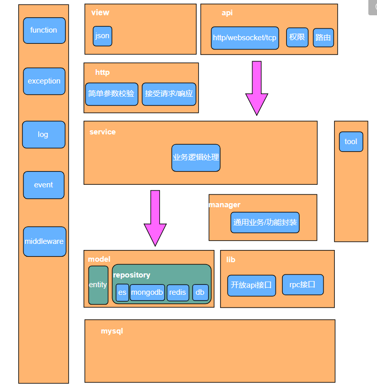

## 应用分层


####  阿里应用分层方案：


#### 分层策略：




#### 1、相邻两层之间调用， 上层依赖下层， 箭头标识可以直接依赖

#### 2、依赖于抽象而非实体


```
​```
Aop							Aop类
	Annotation					自定义注解
	Aspect						自定义切面
	Listener					事件监听
	Middleware					中间件
	...
Common						公共文件
	Abstracts/Base				抽象基类
	Constants					枚举类
	Factory						工厂类
	Request						外部参数验证类
	Function					公共函数文件
	Interfaces					基础接口
Controller					web层
Core						核心业务层
	Manager						封装公共业务
	Service						业务逻辑类
    Util						静态工具类
Lib							第三方服务
Rpc							rpc内部服务
	Interfaces					rpc接口
	Service						rpc业务逻辑
	Client						rpc客户端
Model						数据映射层
	Entity						实体模型
	Repository					模型仓库

​```
```

